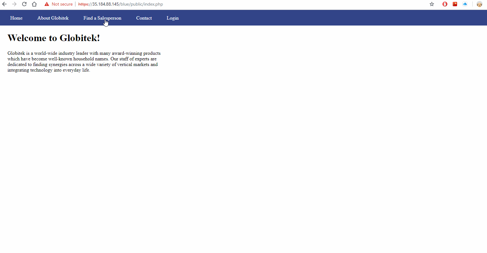
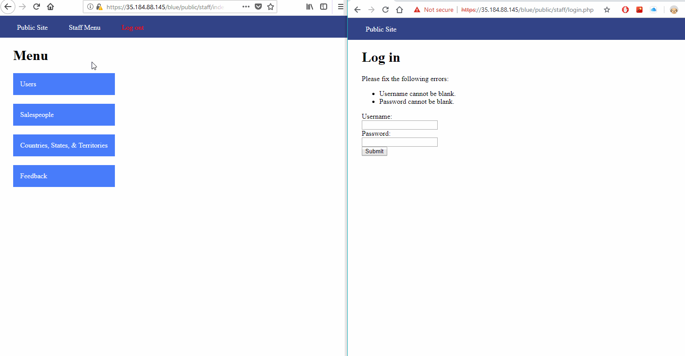
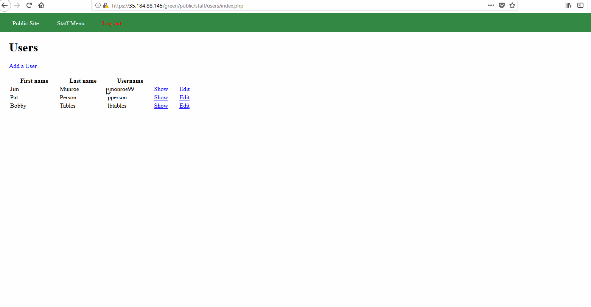
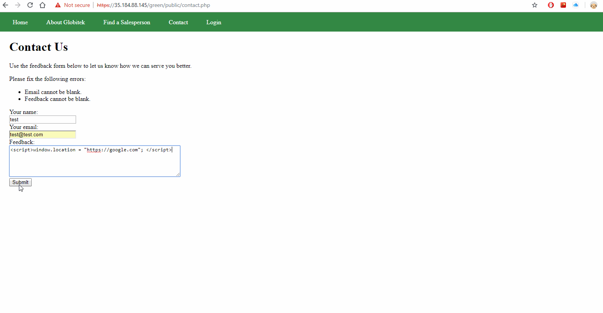

Week 8 Codepath Assignment

Blue Target
1. SQL injection attack

2. Session Hijacking attack

Red Target
1. IDOR attack

2. CSRF attack

Green Target
1. Enumeration Attack

all valid users, who log in unsuccesfully, have the prompt appear bolded, all non-valid users are prompted with an unbolded response

2. Stored XSS attack

